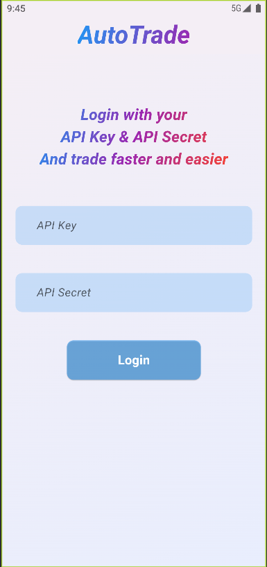
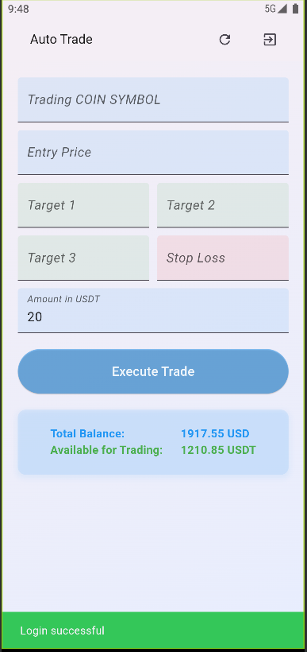
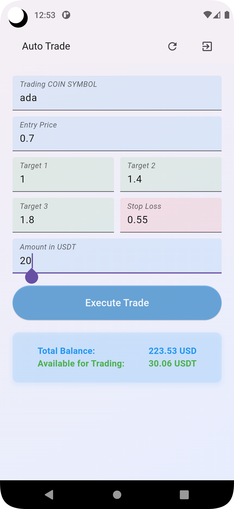
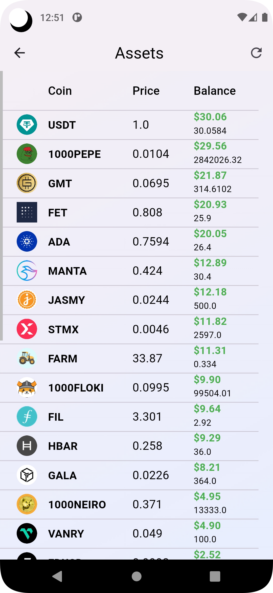

# AutoTrade

AutoTrade is a Flutter application designed to streamline the process of executing trading signals on the Binance platform. With the integration of the Binance API, traders can automate their entire trading process, reducing configuration time from minutes to seconds.

## Screenshots

## Features

- **Automation:** Execute trades seamlessly with minimal manual intervention.
- **Binance Integration:** Utilize the powerful features of the Binance API directly within the app.
- **Quick Setup:** Simply login with your API secret and API key to begin using the app immediately.

## How It Works

AutoTrade leverages the Binance API to connect directly to your Binance account. Once authenticated, you can swiftly execute trades based on your predetermined signals or strategies. The app eliminates the need for manual configuration, allowing you to focus on your trading decisions rather than the technical setup.

## Getting Started

To get started with AutoTrade, follow these steps:

1. **Clone the Repository:** Clone this repository to your local machine.
2. **Install Dependencies:** Ensure you have Flutter installed, then run `flutter pub get` to install the necessary dependencies.
3. **Add API Credentials:** Obtain your Binance API secret and API key from your Binance account. Then, add them to the appropriate fields in the app.
4. **Build and Run:** Build the Flutter project and run the app on your desired platform (iOS or Android).

## Contributing

Contributions are welcome! If you have any ideas for improvements or feature requests, feel free to open an issue or submit a pull request.

## License

This project is licensed under the [MIT License](LICENSE).
